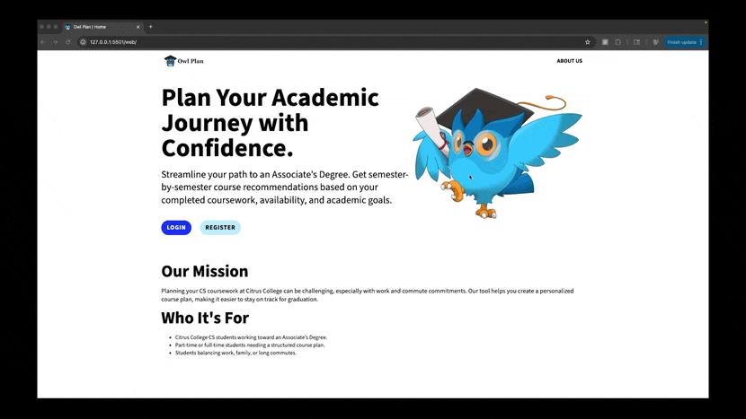

# 🏫 Course Recommendation System 📚

## Table of Contents

- [Overview](#overview)
- [Features](#features)
- [Demo](#demo)
- [Activity Diagram](#activity-diagram)
- [File Structure](#file-structure)
- [Installation](#installation)
- [Future Enhancements](#future-enhancements)
- [License](#license)

## Overview

The **Course Recommendation System** is a full-stack web application built with **Flask, MySQL, and JavaScript**.  
It helps Citrus College students pursuing an Associate Degree for Transfer (AD-T) in Computer Science generate personalized course plans that account for:

- Major requirements
- General Education (GE) requirements
- Prerequisites
- User preferences (full-time/part-time, winter/summer availability)

Users can log in with **Google authentication**, create multiple saved education plans, and view them through an interactive dashboard.

---

## Features

- **Flexible Course Load**: Supports full-time, part-time, and optional Winter/Summer availability.
- **Automatic Course Selection**: Dynamically recommends courses based on prerequisites and category limits.
- **Multiple Saved Plans**: Dashboard to manage and view several degree plans.
- **Secure Authentication**: Login via Google using Firebase Authentication.
- **Interactive Web Portal**: Clean frontend built with HTML, CSS, and JS to view and manage plans.
- **RESTful Backend**: Flask API with structured endpoints for courses, majors, and plans.
- **Database Management**: MySQL backend for scalable course and user data storage.

---

## Demo

A quick walkthrough of the system:



_(Shows home page → login → dashboard → create plan → view saved plan)_

---

## Activity Diagram


---

## File Structure

```
Course-Recommendation-System/
├── backend/ # Flask backend API
│ ├── app.py # Main Flask API script
│ ├── main.js # Firebase authentication handling
│ ├── create_plan.py # Plan generation logic
│ ├── routes/ # Route blueprints
│ ├── db_operations.py # Database helpers
│ ├── .env.example # Example environment file for Firebase keys and credentials
│ └── requirements.txt # Python dependencies
│
├── mysql_version/ # MySQL database schema
│ └── database_v1.0.0.sql # SQL script to create MySQL tables
│
├── sqlite_version/ # Legacy SQLite database & scripts
│ ├── py/ # Python scripts for SQLite version
│ ├── db/ # SQLite database files
│
├── web/ # Web application files
│ ├── index.html # Homepage with login/register buttons
│ ├── about.html # About page with project and team info
│ ├── login.html # Login page for authentication
│ ├── dashboard.html # User dashboard to manage saved plans
│ ├── create-plan.html # Form to generate new plans
│ ├── view-plan.html # Displays individual course plan
│ ├── css/ # Stylesheets
│ ├── js/ # JavaScript files
│ └── img/ # Image assets (logos, diagrams, demo gifs)
│
├── .gitignore # Ignore unnecessary files in Git
├── Procfile # Deployment config (e.g., Render/Heroku)
└── README.md # This README file
```

## Installation

### Prerequisites

- Python 3.x
- MySQL Server
- Flask
- Firebase Authentication for Google Login

### Setup

1. **Clone the Repository**

   ```sh
   git clone https://github.com/joebernal/Course-Recommendation-System
   cd course-recommendation-system
   ```

2. **Set Up MySQL Database**
   - Start MySQL Server
   - Run the MySQL schema script
     ```sh
     mysql -u root -p < mysql_version/database_v1.0.0.sql
     ```

### Set Up Backend

1. **Create a virtual environment** (only needed the first time)

   ```bash
   python3 -m venv venv
   ```

2. **Activate the virtual environment**

   - On **macOS/Linux**:

     ```bash
     source venv/bin/activate
     ```

   - On **Windows**:
     ```cmd
     venv\Scripts\activate
     ```

3. **Create a `.env` file using `.env.example` as a reference**

   ```bash
   cp .env.example .env  # Or manually create it
   ```

4. After activation, your terminal should show something like this:

```bash
(venv) user@machine:~/project$
```

This means the virtual environment is active.

6. **Install dependencies (inside the virtual environment)**

   ```bash
   pip install -r requirements.txt
   ```

7. **Run the Flask API**

   ```bash
   python backend/app.py
   ```

8. **(Optional) Exit the virtual environment**
   ```bash
   deactivate
   ```

---

### Set Up Frontend

To view the frontend in your browser:

1. Open VS Code and navigate to the project folder.
2. Locate the file: `web/index.html`.
3. **Right-click on `index.html`** and select **"Open with Live Server"** (make sure you have the [Live Server extension](https://marketplace.visualstudio.com/items?itemName=ritwickdey.LiveServer) installed).
4. A new browser tab should open automatically with your frontend running on something like `http://127.0.0.1:5501/web/index.html`.

> If Live Server doesn’t open, you can manually go to that URL in your browser or click "Go Live" in the bottom-right of VS Code.

---

## Future Enhancements

- **Cloud Deployment**: Host Flask API and MySQL DB on AWS.
- **Expanded Major Support**: Add additional STEM majors beyond Computer Science.
- **Modern Frontend**: Upgrade UI with React + Material UI.
- **AI-Powered Recommender**: Smarter course sequencing using ML models.

## License

This project is licensed under the MIT License.
