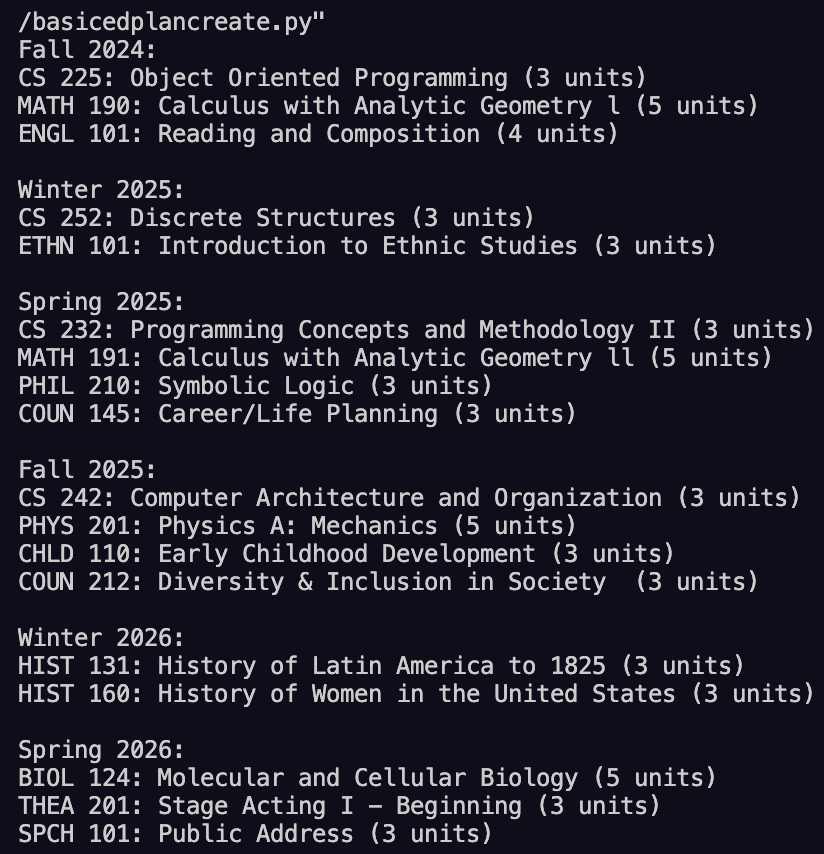

# 🏫 Course Recommendation System 📚

## Table of Contents

- [Overview](#overview)
- [Features](#features)
- [Sample Output](#sample-output)
- [File Structure](#file-structure)
- [Installation](#installation)
- [Future Enhancements](#future-enhancements)
- [License](#license)

## Overview

The Course Recommendation System is designed for students at Citrus College pursuing an Associate Degree for Transfer (AD-T) in Computer Science. It helps students create personalized education plans based on major and general education (GE) requirements. The system dynamically selects courses while tracking previously selected courses to avoid duplication. It integrates multiple SQLite databases to manage course data efficiently.

## Features

- **Flexible Course Load**: Accommodates full-time, part-time, and optional winter and summer session preferences.

- **Automatic Course Selection**: Recommends courses for a structured degree plan.

- **Handles Multiple Databases**: Merges major and GE courses from separate databases.

- **Resets Selections**: Ensures a fresh start for every new plan.

- **Semester-Based Planning**: Assigns courses based on semesters (Fall, Winter, Spring, Summer).

## Sample Output



## File Structure

### **Python Scripts**

- **`addselectedcolumn.py`**

  - Adds a `selected` column to all tables in `csdegreecourses.db` to track chosen courses.

- **`attachdatabase.py`**

  - Attaches `csugecourses.db` to `csdegreecourses.db` and merges tables to maintain a single database.

- **`basicedplancreate.py`**

  - Main script to generate an education plan based on available courses and user preferences.
  - Implements course selection, semester scheduling, and prioritization.

- **`csmajorcourses.py`**

  - Handles course selection for computer science major requirements.

- **`csugecourses.py`**

  - Scrapes and stores GE course data from the Citrus College website.

- **`prereqfunction.py`**
  - Uses Selenium and BeautifulSoup to scrape course prerequisite information.

### **Databases**

- **`csdegreecourses.db`**: Stores major and GE courses.
- **`csmajorcourses.db`**: Contains computer science-specific courses.
- **`csugecourses.db`**: Stores general education courses.

## Installation

### Prerequisites

- Python 3.x
- SQLite3
- Selenium
- BeautifulSoup4

### Setup

1. **Clone the Repository**
   ```sh
   git clone https://github.com/joebernal/Course-Recommendation-System
   cd course-recommendation-system
   ```
2. **Install Dependencies**
   ```sh
   pip install -r requirements.txt
   ```
3. **Run Scripts**
   - To create the database and add the `selected` column:
     ```sh
     python addselectedcolumn.py
     ```
   - To attach databases:
     ```sh
     python attachdatabase.py
     ```
   - To generate a course plan:
     ```sh
     python basicedplancreate.py
     ```

## Future Enhancements

- **Support for More STEM Majors**: Expand to include additional STEM degrees offered at Citrus College.
- **Web Interface**: Provide a UI for students to generate and customize plans.
- **User Authentication**: Allow users to log in and save multiple plans.
- **Cloud Database**: Migrate from SQLite to MySQL for scalability.

## License

This project is licensed under the MIT License.
